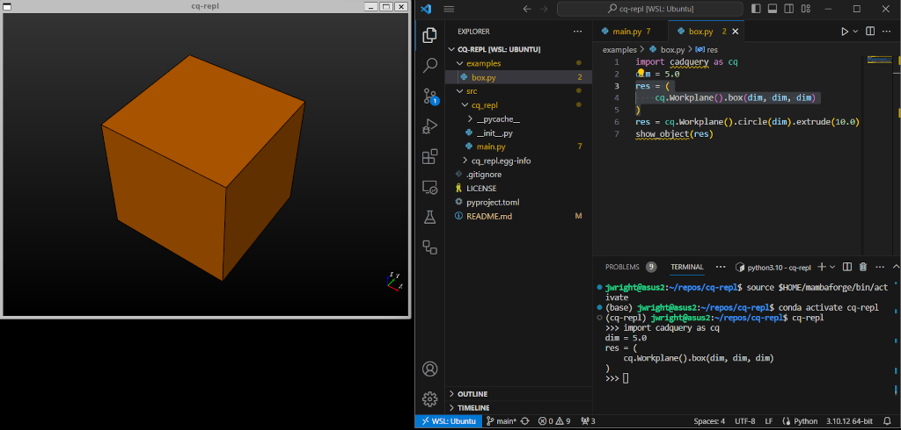

# cq-repl

A REPL interface for CadQuery that displays/updates the models as the lines of code are evaluated. This allows for partial updates of assemblies and quick experimentation while a model or assembly is in development.

**PLEASE NOTE:** This tool is in very early development and is only useful for simple cases currently (see `examples/box.py` and `examples/assy.py`).



# Primary Motivation

As assemblies become more complex with more parts, re-executing an entire assembly causes long wait times and slows the developer's iteration cycle. This REPL is designed to only update the parts of the assembly that the user re-evaluates. This method has drawbacks, an example being that constraint solving cannot be taken properly into account when the whole assembly is not being re-evaluated. The author already does things like exploded views, which tends to break constraints anyway, so this is not as much of a personal concern. Assembly parts that are positioned parametrically in the code will work better with this REPL, but there may still be knock-on effects.

# Inspirations

Work done by @adam-james-v on real time model updates and SVG object generation in Clojure (see the [sdfx](https://github.com/adam-james-v/sdfx) project), as well as the author's own experience with Lisp dialects like Clojure and Common Lisp, inspired this project. Those Lisps encourage iteration and experimentation using theh language's REPL, and Adam has applied this to making real world objects. While Python does not afford the same level of interactivity with the REPL that Clojure and Common Lisp do, it is possible to achieve an approximation.

# Known Limitations

* The implementation is currently *nix only, mainly because of the use of the `select` package to recieve user input in the REPL. The author is not opposed to Windows support, but it will probably need to be added by the community if this tool ends up seeing use by a broader audience than just the author.

# Installation

This package is not available on PyPI. If you have git installed, you can install this tool via pip in a Python virtual environment:
```
pip install git+https://github.com/jmwright/cq-repl.git
```

Alternatively, if you want to contribute, it would be better to do an editable install in a Python virtual environment:
```
git clone https://github.com/jmwright/cq-repl.git
cd cq-repl
pip install -e .
```

# Usage

The author uses this tool with Visual Studio Code, but similar setups should be possible with many other editors. An example usage process is given below for Visual Studio Code.

1. Install the extension [SendToTerminal+](https://marketplace.visualstudio.com/items?itemName=ivoh.sendtoterminalplus).
2. Open a terminal with `Terminal->New Terminal`
3. Switch to the terminal in VSCode and activate the Python virtual environment that cq-repl was installed in.
4. Start cq-repl in the terminal by running the command `cq-repl`.
5. Open `examples/box.py` and work from the top to the bottom, executing each line in turn by clicking on the line and pressing `Shift-Alt-Enter` (the default key combo for SendToTerminal+). Alternatively, you can highlight sections of code (function and class definitions) to be executed at once with `Shift-Alt-Enter`.

As you execute each line, there are a few things to note.

* You will not always get the `>>>` prompt again before a model is displayed or updated, but you can still keep entering lines of code in the REPL. This behavior may be altered in the future depending on how it effects UX.
* Executing a CadQuery object variable declaration or value set will cause the REPL to automatically try to inject a `show_object` call to display the object. This prevents the user from havivng to call that method manually each time an object is altered to speed up the development loop, but could end up causing other usability problems later. It is possible that a command line switch could be added, allowing the user to disable this behavior. We will see.

For an example of using the REPL with assemblies, open and evaluate the lines of `examples/assy.py` in the same way you did in step 5 above.

# License

See the [LICENSE](LICENSE) file.
